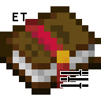

# Enchant Tweaker
Tweak many enchantment related mechanics while keeping the vanilla feel. Currently, contains 68 configuration options.

## Installation
Client-side install is recommended but not required. Some non-critical visual QOL tweaks need to be installed on the client to work properly.

|              | Client-Side  | Server-Side  |
|:------------:|:------------:|:------------:|
| Singleplayer | **Required** |     N/A      |
| Multiplayer  |   Optional   | **Required** |

## Anvil Tweaks
Some small anvil related tweaks. Lightly alters the anvil's mechanics.

 View Anvil Tweaks 

### Cheap Names
Normally renaming an item will cost a similar amount of levels as adding an enchantment onto an item. Enabling this will force the cost for renaming items to always be one level. For those who don't enjoy spending nineteen levels to rename a pickaxe... again.

### Not Too Expensive
Normally once an item's enchant/repair cost reaches 40 levels you can no longer enchant or repair it. Enabling this tweak alters the "Too Expensive!" mechanic in the anvil changing the level it activates at to one of your choosing.

### Prior Work is Cheaper
Normally when enchanting/repairing an item, each operation will double the cost of the next action. Enabling this tweak will let you customize the penalty.

### Prior Work is Free
Normally when enchanting/repairing an item, each operation will double the cost of the next action. Enabling this tweak completely disables the prior work penalty for items enchanted/repaired at an anvil. This means that the enchant/repair cost for an item will always stay at the minimum value for that given procedure.

### Sturdy Anvils
Normally an anvil has a 12% (0.12) chance to take damage when used. Enabling this tweak will let you customize the damage chance.

## Enhanced Enchantments
Some vanilla enchantments tweaked to scale better. Some of these require the enchantment's max level to be increased to take full advantage of the tweak.

 View Enhanced Enchantments 

### More Binding
Enabling this tweak will allow Curse of Binding to scale with enchantment level. Higher levels will decrease the chance of the item dropping on death. The effect maxes out at Curse of Binding X, Binding I is kept the same as vanilla. Formula: `Drop Chance on Death = 1.1 - 0.1 * bindingLevel`.

### More Channeling
Enabling this tweak will allow Channeling to scale with enchantment level. Channeling I only works during thunderstorms. Channeling II will allow Channeling to work during rain. No scaling for higher levels.

### More Flame
Enabling this tweak will allow Flame to scale with enchantment level. Flame I lasts 5 seconds. Each additional level adds 2 seconds. Continues scaling for higher levels (uncapped). Formula: `Burn Duration = 5 + 2 * flameLevel`.

### More Infinity
**Overrides BowInfinityFix.** Enabling this tweak will allow Infinity to scale with enchantment level. Lets bows with Infinity have a chance at shooting without consuming an arrow. Continues scaling for higher levels (capped at 100% chance). Formula: `Free Arrow Chance = 0.03 * infinityLevel`. (+3% chance per level)

### More Mending
Enabling this tweak will allow Mending to scale with enchantment level. Mending II is the same as vanilla Mending. Mending I has ~10% XP efficiency loss and Mending III has ~10% XP efficiency gain. The effect maxes out at Mending X. Formula: `Repair Cost = 0.6 - 0.05 * mendingLevel`.

### More Multishot
Enabling this tweak will allow Multishot to scale with enchantment level. Each additional level will add 2 arrows to the shot. Crossbows take damage for **each** Multishot arrow shot. Continues scaling for higher levels (uncapped).

## Other Tweaks
Some small tweaks that don't fit into the other categories. These are some of the more popular ones.

 View Other Tweaks 

### Axes are Not Tools
Normally axes are treated as tools when used in combat. This causes them to take double durability damage when they are used in combat. Enabling this tweak removes the double durability damage penalty.

### Axe Weapons
Allow the addition of some weapon enchantments that normally can not be added onto axes. Enabling this tweak allows you to add the following enchantments to axes: Fire Aspect, Knockback, and Looting.

### Better Mending
Normally Mending will only repair an item if it is being held or worn by the player. Enabling this tweak will allow Mending to be more flexible with what it can repair. Mending order: Main-Hand -> Off-Hand -> Armor -> Hotbar -> Inventory.

### Bow Infinity Fix
Normally even though you have Infinity on a bow, you need to have arrows in your inventory to shoot. Enabling this tweak will allow you to shoot arrows without having them in your inventory.

### God Armor
Allow the combination of damage negation enchantments that normally can not be added together. Enabling this tweak allows you to combine the following enchantments: Protection, Blast Protection, Fire Protection, and Projectile Protection.

### God Weapons
Allow the combination of damage enhancement enchantments that normally can not be added together. Enabling this tweak allows you to combine the following enchantments: Sharpness, Smite, and Bane of Arthropods.

### Infinite Mending
Normally you need to choose between having either Mending or Infinity. Enabling this tweak allows both enchantments to coexist.

### Loyal Void Tridents
Normally tridents enchanted with Loyalty will be lost if thrown into the void. Enabling this tweak will allow those tridents to return to the player.

### Multishot Piercing
Normally you need to choose between having either Multishot or Piercing. Enabling this tweak allows both enchantments to coexist.

### No Soul Speed Backlash
Normally boots will take damage when walking on soul sand with Soul Speed. Enabling this tweak will prevent your boots from taking damage from the enchantment.

### No Thorns Backlash
Normally armor will take damage when Thorns is triggered. Enabling this tweak will prevent your armor from taking damage from the enchantment.

### Shiny Max Enchantment Names
Normally everyone knows what the max level for an enchantment is, but what about now? Enabling this tweak will color the name of enchantments at max level to be yellow. This tweak is client side only and uses the client's Enchant Tweaker config.

### Trident Weapons
Allow the addition of some weapon enchantments that normally can not be added to tridents. Enabling this tweak allows you to add the following enchantments to tridents: Sharpness, Smite, Bane of Arthropods, Fire Aspect, Knockback, and Looting.

## Modify Max Enchantment Levels
Tweak the max level for individual enchantments. Not all vanilla enchantments scale by default. Some may require enabling their respective tweak to scale properly.

 View Suggested Custom Enchantment Levels 

### Armor Enchantments:
|      Enchantment      | Max Level |
|:---------------------:|:---------:|
|     Aqua Affinity     |     1     |
|   Blast Protection    |    10     |
|     Depth Strider     |     3     |
|    Feather Falling    |     7     |
|    Fire Protection    |    10     |
|     Frost Walker      |     2     |
| Projectile Protection |    10     |
|      Protection       |    10     |
|      Respiration      |    10     |
|      Soul Speed       |     5     |
|      Swift Sneak      |     4     |
|        Thorns         |     5     |

### Curse Enchantments:
|      Enchantment      | Max Level |
|:---------------------:|:---------:|
|     Binding Curse     |     1     |
|    Vanishing Curse    |     1     |

### Melee Enchantments:
|      Enchantment      | Max Level |
|:---------------------:|:---------:|
|  Bane of Arthropods   |    10     |
|      Fire Aspect      |     3     |
|       Impaling        |     5     |
|       Knockback       |     2     |
|        Looting        |     5     |
|       Sharpness       |    10     |
|         Smite         |    10     |
|     Sweeping Edge     |     5     |

### Ranged Enchantments:
|      Enchantment      | Max Level |
|:---------------------:|:---------:|
|      Channeling       |     2     |
|         Flame         |     2     |
|       Infinity        |     1     |
|        Loyalty        |     5     |
|       Multishot       |     3     |
|       Piercing        |     5     |
|         Power         |    10     |
|         Punch         |     2     |
|     Quick Charge      |     3     |
|        Riptide        |     3     |

### Tool Enchantments:
|      Enchantment      | Max Level |
|:---------------------:|:---------:|
|      Efficiency       |    10     |
|        Fortune        |     5     |
|         Lure          |     3     |
|    Luck of the Sea    |     5     |
|        Mending        |     3     |
|      Silk Touch       |     1     |
|      Unbreaking       |    10     |

