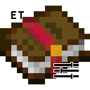

<!-- main logo -->

<!-- large badges -->

<!-- badges -->

# Enchant Tweaker
Tweak many enchantment related mechanics while keeping the vanilla feel. Currently, contains 140 configuration options.

## Installation
Client-side install is recommended but not required. Some non-critical visual QOL tweaks (Not Too Expensive, Shiny Names) need to be installed on the client to work properly.

|              | Client-Side  | Server-Side  |
|:------------:|:------------:|:------------:|
| Singleplayer | **Required** |     N/A      |
| Multiplayer  |   Optional   | **Required** |

## Anvil Tweaks
Some small anvil related tweaks. Lightly alters the anvil's mechanics.

 View Anvil Tweaks 

### Cheap Names
Normally renaming an item will cost a similar amount of levels as adding an enchantment onto an item. Enabling this will force the cost for renaming items to always be one level. For those who don't enjoy spending nineteen levels to rename a pickaxe... again.

### Not Too Expensive
Normally once an item's enchant/repair cost reaches 40 levels you can no longer enchant or repair it. Enabling this tweak alters the "Too Expensive!" mechanic in the anvil changing the level it activates at to one of your choosing. Client-side install will hide the "Too Expensive!" message. Otherwise, it will still appear but will not prevent the action.

### Prior Work is Cheaper
Normally when enchanting/repairing an item, each operation will double the cost of the next action. Enabling this tweak will let you customize the penalty.

### Prior Work is Free
Normally when enchanting/repairing an item, each operation will double the cost of the next action. Enabling this tweak completely disables the prior work penalty for items enchanted/repaired at an anvil. This means that the enchant/repair cost for an item will always stay at the minimum value for that given procedure.

### Sturdy Anvils
Normally an anvil has a 12% (0.12) chance to take damage when used. Enabling this tweak will let you customize the damage chance.

### Anvil Repair
Allows repairing damaged anvils by sneak+right-clicking with iron ingots or iron blocks. Each repair reverses one degradation step (damaged → chipped → pristine). Iron ingot cost (default 9) and iron block cost (default 1) are configurable independently. Set a cost to 0 to disable that repair type.

## Enhanced Enchantments
Some vanilla enchantments tweaked to scale better. Some of these require the enchantment's max level to be increased to take full advantage of the tweak.

 View Enhanced Enchantments 

### More Binding
Enabling this tweak will allow Curse of Binding to scale with enchantment level. Higher levels will decrease the chance of the item dropping on death. The effect maxes out at Curse of Binding X, Binding I is kept the same as vanilla. Formula: `Drop Chance = 1.0 + step - step * bindingLevel`. The step is configurable (default 0.1).

### More Blast Protection
Enabling this tweak will replace the additive blast protection knockback formula with multiplicative scaling. Knockback never reaches zero. Formula: `Knockback = knockback * base^level`. The base is configurable (default 0.85, meaning 15% reduction per level).

### More Channeling
Enabling this tweak will allow Channeling to scale with enchantment level. Channeling I only works during thunderstorms. Channeling II will allow Channeling to work during rain. No scaling for higher levels.

### More Fire Protection
Enabling this tweak will replace the additive fire protection duration formula with multiplicative scaling. Fire duration never reaches zero. Formula: `Duration = duration * base^level`. The base is configurable (default 0.85, meaning 15% reduction per level).

### More Flame
Enabling this tweak will allow Flame to scale with enchantment level. Flame I lasts 5 seconds. Each additional level adds extra burn time. Continues scaling for higher levels (uncapped). Formula: `Burn Duration = 5 + per_level * (flameLevel - 1)`. The per-level increment is configurable (default 2).

### More Infinity
**Overrides BowInfinityFix.** Enabling this tweak will allow Infinity to scale with enchantment level. Lets bows with Infinity have a chance at shooting without consuming an arrow. Continues scaling for higher levels (capped at 100% chance). Formula: `Free Arrow Chance = pct * infinityLevel`. The per-level percentage is configurable (default 0.03, meaning +3% per level).

### More Looting
Enabling this tweak will make Looting also increase XP drops from mob kills. Higher Looting levels give more bonus XP. Formula: `XP = xp * (1.0 + lootingLevel * multiplier)`. The multiplier is configurable (default 0.5, meaning +50% XP per Looting level).

### More Mending
Enabling this tweak will allow Mending to scale with enchantment level. Mending II is the same as vanilla Mending. Mending I has ~10% XP efficiency loss and Mending III has ~10% XP efficiency gain. Formula: `Repair Cost = clamp(0.6 - step * mendingLevel, floor, 0.6)`. Both step (default 0.05) and floor (default 0.1) are configurable.

### More Multishot
Enabling this tweak will allow Multishot to scale with enchantment level. Each additional level adds extra arrows to the shot. Crossbows take damage for **each** Multishot arrow shot. Continues scaling for higher levels (uncapped). Formula: `Arrow Count = multishotLevel * per_level + 1`. The per-level increment is configurable (default 2).

### More Protection
Enabling this tweak will replace the additive EPF protection formula with multiplicative scaling. Protection never reaches 100% immunity. Formula: `Damage = damage * base^epf`. The base is configurable (default 0.96, meaning 4% reduction per EPF point).

## Other Tweaks
Some small tweaks that don't fit into the other categories. These are some of the more popular ones.

 View Other Tweaks 

### Axes are Not Tools
Normally axes are treated as tools when used in combat. This causes them to take double durability damage when they are used in combat. Enabling this tweak removes the double durability damage penalty.

### Axe Weapons
Allow the addition of some weapon enchantments that normally can not be added onto axes. Enabling this tweak allows you to add the following enchantments to axes: Fire Aspect, Knockback, and Looting.

### Better Mending
Normally Mending will only repair an item if it is being held or worn by the player. Enabling this tweak will allow Mending to be more flexible with what it can repair. Mending order: Main-Hand -> Off-Hand -> Armor -> Hotbar -> Inventory.

### Bow Infinity Fix
Normally even though you have Infinity on a bow, you need to have arrows in your inventory to shoot. Enabling this tweak will allow you to shoot arrows without having them in your inventory.

### Bow Looting
Normally Looting can only be applied to swords. Enabling this tweak allows Looting to be applied to bows and crossbows.

### Disable Enchantments
Prevent specific enchantments from appearing in enchanting tables, loot, villager trades, and anvils. Provide a comma-separated list of enchantment IDs to disable (e.g. `sharpness,mending,infinity`). Disabled enchantments override villager trade limits — they cannot be traded at all.

### God Armor
Allow the combination of damage negation enchantments that normally can not be added together. Enabling this tweak allows you to combine the following enchantments: Protection, Blast Protection, Fire Protection, and Projectile Protection.

### God Weapons
Allow the combination of damage enhancement enchantments that normally can not be added together. Enabling this tweak allows you to combine the following enchantments: Sharpness, Smite, and Bane of Arthropods.

### Grindstone Disenchanting
Extract enchantments from items into books using a grindstone. Place an enchanted item and a regular book in the grindstone to transfer all non-curse enchantments to the book. Also supports splitting: place a multi-enchantment book and a regular book to split one enchantment off. Curses are never extracted and remain on the original item. Optionally keeps the clean item in your inventory (`grindstone_disenchant_keep_item`).

### Infinite Mending
Normally you need to choose between having either Mending or Infinity. Enabling this tweak allows both enchantments to coexist.

### Loyal Void Tridents
Normally tridents enchanted with Loyalty will be lost if thrown into the void. Enabling this tweak will allow those tridents to return to the player.

### Multishot Piercing
Normally you need to choose between having either Multishot or Piercing. Enabling this tweak allows both enchantments to coexist.

### No Mending + Unbreaking
Normally Mending and Unbreaking can coexist on the same item. Enabling this tweak makes them mutually exclusive.

### No Soul Speed Backlash
Normally boots will take damage when walking on soul sand with Soul Speed. Enabling this tweak will prevent your boots from taking damage from the enchantment.

### No Thorns Backlash
Normally armor will take damage when Thorns is triggered. Enabling this tweak will prevent your armor from taking damage from the enchantment.

### Protection Bypass
Normally all damage types are reduced by the Protection enchantment. Enabling this tweak allows specific damage types to bypass Protection entirely. Provide a comma-separated list of damage type IDs (e.g. `magic,thorns,wither`). Modded damage types are also supported.

### Roman Numerals
Vanilla only displays enchantment levels I through X (1-10). Enabling this tweak dynamically generates Roman numeral names for all levels above X (e.g. Sharpness XI, Protection XV). Client-side installation is required for this tweak. Enabled by default.

### Shiny Max Enchantment Names
Normally everyone knows what the max level for an enchantment is, but what about now? Enabling this tweak will color the name of enchantments at max level to be yellow. Client-side installation is required for this tweak, it uses the client's Enchant Tweaker config.

### Trident Weapons
Allow the addition of some weapon enchantments that normally can not be added to tridents. Enabling this tweak allows you to add the following enchantments to tridents: Sharpness, Smite, Bane of Arthropods, Fire Aspect, Knockback, and Looting.

### XP Scaling
Replace vanilla's tiered XP-per-level formula with a configurable linear curve. Vanilla uses three tiers: levels 0-15 (cheap), 16-30 (medium), 31+ (expensive). This replaces all tiers with: `XP per level = base + step * currentLevel`. Both base (default 7) and step (default 2) are configurable — defaults match vanilla's first tier and continue linearly.

## Villager Trade Limits
Control enchantment trade availability for villagers. Limit how many times enchantment trades can be used and whether they restock. Only affects trades that sell enchanted items (books, tools, weapons, armor). Non-enchantment trades are never affected.

 View Villager Trade Limits 

### Global Settings
Set `enchant_trade_max_uses` to limit all enchantment trades globally (-1 = vanilla). Toggle `enchant_trade_restock` to control whether trades restock. Add enchantment IDs to `enchant_trade_no_restock` (comma-separated) to prevent specific trades from restocking.

### Per-Enchantment Overrides
Override max uses for individual enchantment trades with `trade_<enchantment>` keys. Accepted values: -1 (use global default), 0 (disable trade entirely), 1+ (custom max uses). When a trade sells multiple enchantments (e.g. enchanted tools), the most restrictive limit wins.

## Modify Max Enchantment Levels
Tweak the max level for individual enchantments. Not all vanilla enchantments scale by default, some have capped effects at certain levels. For example: Protection 255 would still be affected by vanilla's 25 EPF cap despite going far above it. To avoid these limits you can enable a tweak from the 'Enhanced Enchantments' section (if available).

 View Suggested Custom Enchantment Levels 

### Armor Enchantments:
|      Enchantment      | Max Level |
|:---------------------:|:---------:|
|     Aqua Affinity     |     1     |
|   Blast Protection    |    10     |
|     Depth Strider     |     3     |
|    Feather Falling    |     7     |
|    Fire Protection    |    10     |
|     Frost Walker      |     2     |
| Projectile Protection |    10     |
|      Protection       |    10     |
|      Respiration      |    10     |
|      Soul Speed       |     5     |
|      Swift Sneak      |     4     |
|        Thorns         |     5     |

### Curse Enchantments:
|      Enchantment      | Max Level |
|:---------------------:|:---------:|
|     Binding Curse     |     1     |
|    Vanishing Curse    |     1     |

### Melee Enchantments:
|      Enchantment      | Max Level |
|:---------------------:|:---------:|
|  Bane of Arthropods   |    10     |
|      Fire Aspect      |     3     |
|       Impaling        |     5     |
|       Knockback       |     2     |
|        Looting        |     5     |
|       Sharpness       |    10     |
|         Smite         |    10     |
|     Sweeping Edge     |     5     |

### Ranged Enchantments:
|      Enchantment      | Max Level |
|:---------------------:|:---------:|
|      Channeling       |     2     |
|         Flame         |     2     |
|       Infinity        |     1     |
|        Loyalty        |     5     |
|       Multishot       |     3     |
|       Piercing        |     5     |
|         Power         |    10     |
|         Punch         |     2     |
|     Quick Charge      |     3     |
|        Riptide        |     3     |

### Tool Enchantments:
|      Enchantment      | Max Level |
|:---------------------:|:---------:|
|      Efficiency       |    10     |
|        Fortune        |     5     |
|         Lure          |     3     |
|    Luck of the Sea    |     5     |
|        Mending        |     3     |
|      Silk Touch       |     1     |
|      Unbreaking       |    10     |

